# Movie-Crawler 全国电影信息、票房排片信息爬虫集

海量数据第1小组
- 金嘉浩 14051616
- 汪李贤 14208127
- 卢陈侃 14194813
- 徐明湖 14015124
- 褚浩臻 14198737

[TOC]

## 1. 简介
### 1.1 综述
- 基于Python的全国电影信息、票房排片信息爬虫集
- 包含信息展示的页面和信息查询后台，部署在阿里云服务器

### 1.2 数据来源
1. [中国票房网(CBO)](http://www.cbooo.cn/)   以下简称CBO
2. [时光网(Mtime)](http://www.mtime.com/)      以下简称Mtime
3. [电影票房数据库(58921)](http://58921.com/)  以下简称58921

### 1.3 包含爬虫
1. 正在上映电影爬虫(来源:CBO)
    - 正在上映电影信息
    - 正在上映电影的每日票房和排片
2. 影人、公司爬虫(来源:CBO)
    - 影人信息(包含导演和演员)
    - 公司信息(电影制作商、发行商)
3. 电影影院排片爬虫(来源:Mtime)
    - 当天和之后一天的全国所有影院电影排片
    - 有排片的电影信息
4. 电影每日排片爬虫(来源:58921)
    - 正在上映的热门影片的每日拍片信息
5. 全国影院爬虫(来源:Mtime)
    - 全国所有的影院
6. 影院信息爬虫(来源:Mtime)
  - 爬取所有影院的影院信息
7. 历史电影爬虫(来源:CBO)
    - 之前几年上映过电影和电影信息
8. 历史电影排片爬虫(来源:CBO)
    - 之前几年上映过的电影每日排片数量
9. 城市电影排片数爬虫(58921)
    - 特定城市的电影每日排片数

## 2. 成员分工
- 金嘉浩(组长)
    - 爬虫框架搭建
    - 组员分工统筹
    - 实验报告编写
    - 1.正在上映电影爬虫
    - 3.电影影院拍片爬虫
    - 5.全国影院爬虫
- 汪李贤
    - 展示页面后台编写
    - 4.电影每日排片爬虫
    - 9.城市电影排片数爬虫
    - 数字图片识别工具
- 卢陈侃
    - 实验报告编写
    - 2.影人、公司爬虫
    - 6.历史电影爬虫
    - 8.历史电影排片爬虫
- 徐明湖
    - 实验报告编写
    - 1.正在上映电影爬虫
    - 6.影院信息爬虫
- 褚浩臻
    - 展示页面前端设计
    - 展示页面前端编写

## 3. 开发环境/使用工具

- Python 3.5
- IDE: JetBrains PyCharm
- Chrome 开发者工具
- Python第三方库:
    - requests
    - BeautifulSoup4
    - pandas
- 前端
    - html + css
    - JavaScript
- 后端
    - Java JDBC

## 4.系统设计
### 4.1 需求分析
我们这个项目的需求主要是从三个数据源网站(CBO、Mtime、58921)爬取信息。
所要爬取的信息主要是影片信息、影人和公司信息、影片票房(不同城市)、每日排片数量(不同城市)、影院具体排片时间等。

- CBO中国票房网 需求:
    - 演员
        - 演员中文名
        - 演员英文名
        - 演员国籍
    - 公司
        - 公司中文名
        - 公司英文名
        - 公司所属国籍
    - 影片
        - 影片中文名
          - 影片英文名
        - 影片类型
        - 影片放映长度
        - 影片首映日期
        - 影片制式
        - 票房总数
        - 平均票价
        - 平均观影人数
        - 口碑指数
    - 影片票房
        - 票房日期
        - 票房数量
        - 平均观影人数
    - 影片排片
        - 影片放映日期
        - 影片放映日期
        - 影片放映场次数
- Mtimes时光网 需求:
    - 全国影院每日具体排片
        - 影厅座位数量
        - 放映厅名称
        - 语言
        - 开始放映时间
        - 结束时间
        - 时光网票价
        - 制式
    - 全国所有影院信息
        - 影院名称
        - 影院厅总数
        - 影院座位总数
        - 影院地址
        - 影院联系电话
        - 影院营业时间
    - 全国所有地区信息
        - 地区字符串码
        - 城市中文名
        - 城市英文名
    - 影院-影片
        - 影片上映日期
        - 放映场次
        - 总票房数
        - 总观影人数
    - 时光网影片信息
        - 影片英文名
        - 影片中文名
        - 影片类型
        - 影片片场
        - 导演
        - 年份
- 58921电影票房数据库 需求:
    - 影片每日排片 
    - 影片中文名
    - 排片信息日期
    - 排片信息城市名称
    - 排片数

### 4.2  详细设计
>注: 0开头的为每天都要运行的爬虫，1开头的为只需要隔较长一段时间运行一次的爬虫

- 01_current_movie：爬取CBO中正在上映的电影信息(包括电影基本信息、排片、票房)
    - 从中国票房网获取正在上映的电影的ID号
    - 根据ID获取正在上映电影详细信息
    - [中国票房网票房信息API](http://www.cbooo.cn/BoxOffice/GetDayBoxOffice?num=0)
    - 解析中国票房网票房信息json数据
    - 根据解析的json获得正在上映影片的每日票房
- 02_actor_company：爬取CBO电影中所有参与的影人和公司
    - 根据数据库中已经获取的演员的ID,从CBO爬取演员信息
    - 根据数据库中已经获取的公司的ID,从CBO爬取公司的信息
- 03_movie_showtime：从Mtime获取全国所有影院的每日具体排片信息
    - 根据影院ID和日期，通过Mtime的API获取该影院该日的排片情况
    - 根据时光网获取的排片的电影的ID，查询该电影在Mtime的信息
- 04_movie_schedule：从58921获取电影城市每日排片数量
    - 从58921获取该页面热门影片的ID号
    - 根据获取的热门影片的ID从58921电影排片网页来爬取影片排片数据
- 10_cinema：从Mtime获得全国影院信息
    - 通过时光网获取全国城市和影院信息data
    - 读取txt并将原先的JavaScript个数的数据转换为json格式的数据
    - 使用Python解析json文件
    - 通过解析的数据来获取全国城市信息和影院信息
- 11_updateCityData：从Mtime获得所有城市信息
    - 获取数据库中存放的城市信息
    - 将城市信息列表中的StringID统一，方便以后的爬取
- 12_cinemaInfo：从Mtime爬取影院的详细信息
    - 读取数据库中的影院ID和城市StringID
    - 使用城市StringID和影院ID通过Mtime获取影院相信信息
- 13_history_movie：从CBO爬取几年前上映的电影信息
    - 以年份、地区为条件筛选并获取CBO上所有存在的全球影片详细信息
- 14_history_scene：从CBO获取历史排片信息
    - 以日期、城市信息来获取CBO上的历史每日排片信息
- 15_city_movie_schedule：从58921爬取上映电影每个城市每日排片的数量信息
    - 通过从58921获取的热门影片信息来获取城市url列表和电影名称列表
    - 通过获取的城市url获取城市具体排片日期列表
    - 通过日期获取影片在每个城市具体日期的具体片信息

## 5.实现方法
### 5.1 爬取当前热门影片信息(CBO)
- **直接爬取网页上的内容：** 选择待爬取的URL，用浏览器查看网页html代码，先使用request库中request.get(url).text函数获得当前URL的text内容，这一步下载URL的内容，转换完毕后。再用BeautifulSoup把text保存为lxml对象，解析需要的内容。如在爬取当前每日的票房榜前十，我们需要获得影片名称（ID号），实时票房，票房占比，累计票房，排片占比和上映天数。

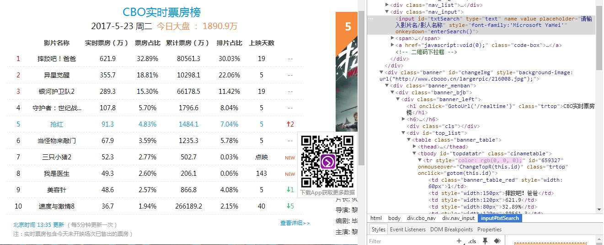

我们首先获得这些影片的ID值，在代码中实现，如下：
```python
        results = soup.find_all('tr', class_='trtop', onmouseover='ChangeTopR(this.id)')
```
取得了信息之后，要保存这个信息。代码中实现：

```python
    for result in results:
        print(result['id'])
        movieIDList.append(result['id'])
    return movieIDList
```

返回一个List是为了后面更方便的爬取。
再根据这个ID值，爬取电影的信息包括  名称，类型，片长，制式等。存储进Dict中，再转入数据库。


部分Dict和存储代码实现：

```python
    movieDataDict = {'id':movieID,
                     'cname':None,
                     'ename':None,
                     'type':None,
                     'length':None,
                     'releasetime':None,
    ......

    for element in result1.stripped_strings:
        if isSumBoxOffice == True:
            movieDataDict['sumboxoffice'] = int(float(element[0:-1]) * 10000)
            isSumBoxOffice = False
        elif i == 0:
            movieDataDict['cname'] = element
        elif i == 2:
            movieDataDict['ename'] = element
        elif element[0] == '类':
            movieDataDict['type'] = element[3:]
    ......
```

除此之外，我们还爬取了部分影片的票价，观影人数和口碑指数。但是部分数据在服务器上未记录，所以未能获得所有数据。这部分内容是通过网页的json内容爬取。如下：

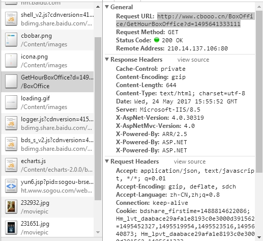


代码实现如下：

```python
    movieBoxOfficeList = json.loads(json_data)['data1']  #将json网页数据通过json库转换为list
    for movieBoxOfficeDict in movieBoxOfficeList:
        movieBoxOfficeDict['Date'] = MovieUtils.str2date(current_Date.strftime('%Y-%m-%d'))  #在每日的票房Dict中添加日期
        del movieBoxOfficeDict['MovieImg']   #删除Dict中的无效键值
        movieBoxOfficeDict['BoxOffice'] = 10000 * int(movieBoxOfficeDict['BoxOffice'])   #票房数值单位转换
    return movieBoxOfficeList
```

### 5.2 爬取影人信息、公司信息(CBO)
以爬取影人信息为例。公司信息和影人信息的页面结构相同，爬取方式也相同，所以这里不再赘述。
首先我们已经抓取了一些影片，我们可以拿到这些影片中参演人员的ID号。
**直接寻找html上的element信息：** 接下来跟爬取热门影片时类似，我们所需要的演员等的信息包括演员的中文名，英文名，国籍等信息。
大概过程如下。


代码中实现为：
```python
   try:
        for element in taxi.stripped_strings:
            actorDataDict['IsLoad'] = True
            if i == 0:
                actorDataDict['CName'] = element
            elif i == 1:
                actorDataDict['EName'] = element
            elif element[0] == '国':
                actorDataDict['Nation'] = element[3:]
            elif element[0] == '生':
                pass
            i = i + 1
        i = 0
    except Exception as e:
        print('Error in CRAWING # ' + str(actorID) ,'into data base: ' + e)
        ......
            try:
        for apple in apples.stripped_strings:
            if i == 0:
                companyDataDict['CName'] = apple
            elif i == 1:
                companyDataDict['Nation'] = apple
            elif i == 2:
                companyDataDict['EName'] = apple
            i = i + 1
        i = 0
```

### 5.3 爬取影院信息(时光网)
**直接从data获取影院信息：** 在这里我们遇到了一个问题，一开始无法获得完整的全国影院数据。(见7.2)后来我们在浏览时光网时发现了其传输的一个数据文件。它是由JavaScript格式保存的全国影院信息。具体如下图：

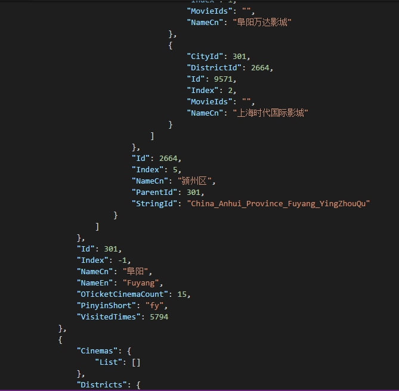

我们将数据进行处理，先转化成Json，然后用Python将数据解析出来。
处理保存这些电影院信息代码如下：
```python
    for districts in data:
        city = {
            'cityid': None,
            'parentid' : 0,
            'stringid' : None,
            'ename' : None,
            'cname' : None
        }
        city['cityid'] = districts['Id']
        city['parentid'] = districts['Id']
        city['cname'] = districts['NameCn']
        city['ename'] = districts['NameEn']
        city['stringid'] = districts['NameEn']
        city_list.append(city)

        for cinema in districts['Cinemas']['List']:
            cinema_list.append(cinema)
```
对于这些影院的更加详细的信息，我们还在时光网上爬取了对应的影院座位数量，营业时间，地址，电话等信息。而这些信息的爬取方式是通过html中的element元素，上面已经有类似的爬取过程，不多展示。

### 5.4 爬取城市区域信息(58921)
**根据爬到的城市区域ID号来整理城市信息：** 我们要爬取的城市大致分为一线城市和二线城市，如北京，上海，广州，成都等城市的城市号和下辖的县市的信息。
比如我们需要城市的url列表，我们从58921网站爬取这些信息，代码实现如下：

```python
    city_list = re.findall('<a href="(/film/.*?)" .*?>', html_text)
    return city_list, movie_name
```

### 5.5 爬取影院排片情况(时光网)
影院的每日排片数据十分庞大，而且很难获取。(问题7.2)
我们发现了时光网的隐藏API，可以通过访问这个API获取JavaScript格式的每日排片文件。
信息数据如下格式：

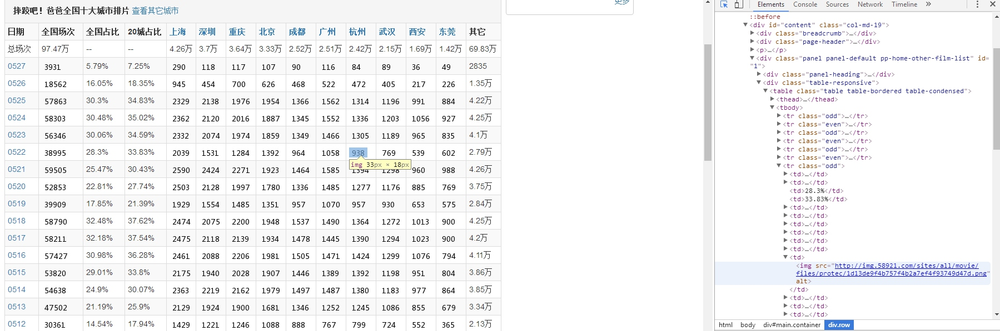

**爬取时光网影片放映情况：** 我们根据影院ID和放映日期来访问API，获得对应影院的放映情况。解析JavaScript数据时，我们使用有一个解析javascript的库execjs，使用正则表达式匹配js的值，再用库处理js值。代码处理：
```python
    try:
        var = re.match(r'^var GetShowtimesJsonObjectByCinemaResult = (.+);', text).group(1)     # 获取javascript值
        if var:
            var = execjs.eval(var)      # 用库处理js值
            return var
    except:
        print('error in var = re.match ')
```

### 5.6  爬取影片排片(58921)
**爬取部分城市的排片占比：** 除了时光网和CBO的影片数据，我们还爬取了58921的影片在城市的排片占比情况，但是58921有设置增加爬虫成本的部分。即网站的数据并不是用数字书写的，而是使用图片展示。如图中所示，


(问题7.1)我们发现这个数字部分是一个img图片，增加了爬取难度。为此，我们需要首先获得这个img的url，代码实现：

```python
img_urls = re.findall('', img_urls[i], html_text, count=1)
```

这里还使用到了pandas解析库，利用pandas的read_html函数获取表格

```python
# 用正则表达式提取出链接中的完整日期(带年份)
    reg = r'<a href="/hour/film_' + movie_id + '_(.*)" .*</a>'
    html_text = re.sub(reg, r'\1', html_text)
    # 利用pandas的read_html函数获取到表格
    table = pd.read_html(html_text, header=0)[0]
    return table, movie_name
```

当然，如果你不改变网页的编码的话，中文显示会出现乱码现象，所以还要有编码的修改。

```python
html_text = html_text.encode('latin1').decode('utf-8')
```

## 6. 实现效果
### 6.0 数据库结构设计

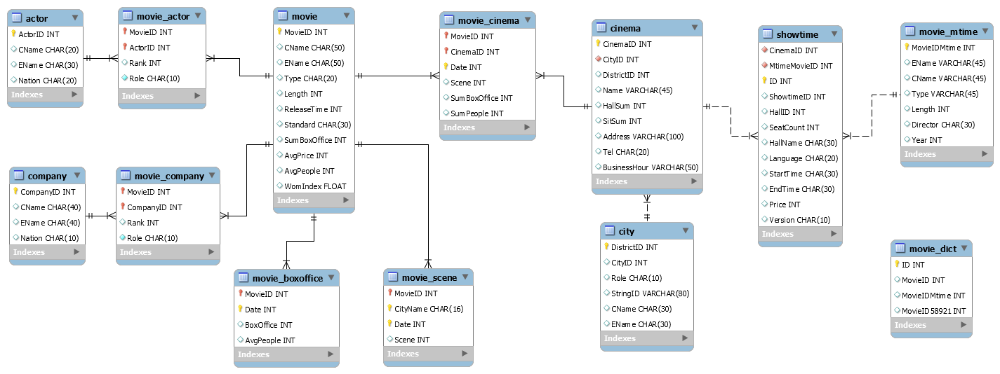

### 6.1 影片信息数据表

影片数据表的字段说明：

| 属性名               | 属性说明   | 类型    | 主键   | 是否为空 |
| ----------------- | ------ | ----- | ---- | ---- |
| MovieID           | 影片ID号  | Int   | 主键   | 不为空  |
| MovieCname        | 影片中文名  | Char  |      |      |
| MovieEname        | 影片英文名  | Char  |      |      |
| MovieType         | 影片类型   | Char  |      |      |
| MovieLength       | 影片放映长度 | Int   |      |      |
| MovieReleaseTime  | 影片首映日期 | Int   |      |      |
| MovieStandard     | 影片制式   | Char  |      |      |
| MovieSumBoxOffice | 票房总数   | Int   |      |      |
| MovieAvgPrice     | 平均票价   | Int   |      |      |
| MovieAvgPeople    | 平均观影人数 | Int   |      |      |
| MovieWomIndex     | 口碑指数   | Float |      |      |

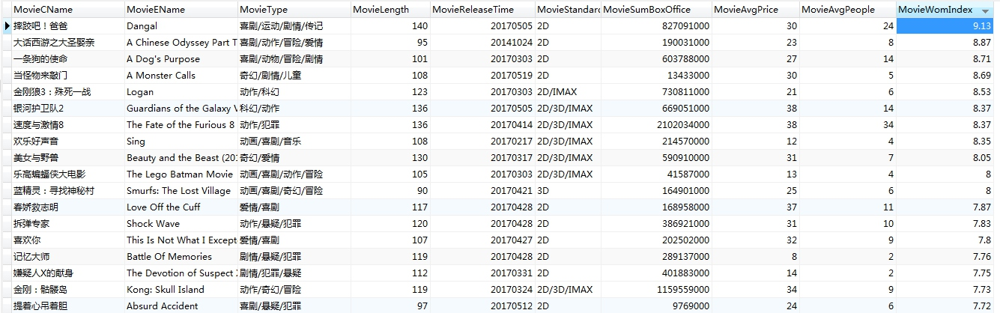

### 6.2 演员信息数据表
演员数据表字段说明：

| 属性名         | 属性说明  | 类型   | 主键   | 是否为空 |
| ----------- | ----- | ---- | ---- | ---- |
| ActorID     | 演员ID号 | Int  | 主键   | 不为空  |
| ActorCName  | 演员中文名 | Char |      |      |
| ActorEName  | 演员英文名 | Char |      |      |
| ActorNation | 演员国籍  | Char |      |      |

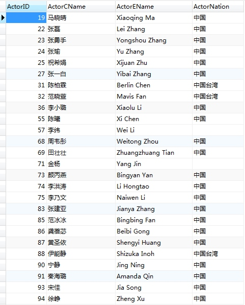

### 6.3 城市信息数据表
城市数据表字段说明：

| 属性名              | 属性说明   | 类型      | 主键   | 是否为空 |
| ---------------- | ------ | ------- | ---- | ---- |
| DistrictID       | 地区Id号  | Int     | 主键   | 不为空  |
| CityID           | 城市Id号  | Int     |      |      |
| DistrictstringID | 地区字符串码 | Varchar |      |      |
| CityCname        | 城市中文名  | Char    |      |      |
| CityEname        | 城市英文名  | Char    |      |      |

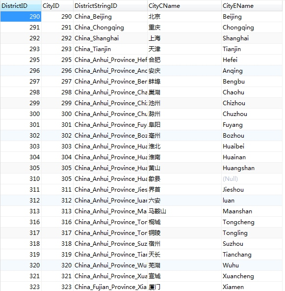

### 6.4 影院信息数据表
电影院数据表字段说明：

| 属性名                | 属性说明     | 类型      | 主键   | 是否为空 |
| ------------------ | -------- | ------- | ---- | ---- |
| CinemaID           | 影院Id号    | Int     | 主键   | 不为空  |
| CityID             | 城市Id号    | Int     | 主键   |      |
| DistrictID         | 区域Id号    | Int     |      |      |
| CinemaName         | 影院名称     | Varchar |      |      |
| CinemaHallsum      | 影院厅总数    | Int     |      |      |
| CinemaSeatsum      | 影院座位总数   | Int     |      |      |
| CinemaAddress      | 影院地址     | Varchar |      | 不为空  |
| CinemaTel          | 影院联系电话   | Char    |      |      |
| CinemaBusinesshour | 影院营业时间   | Char    |      |      |
| CinemaParking      | 影院是否有停车位 | Bit     |      |      |

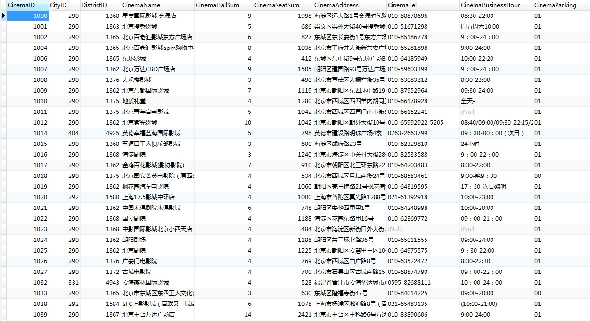

### 6.5 公司信息数据表
公司数据表字段说明：

| 属性名           | 属性说明   | 类型      | 主键   | 是否为空 |
| ------------- | ------ | ------- | ---- | ---- |
| CompanyID     | 公司Id号  | Int     | 主键   | 不为空  |
| CompanyCname  | 公司中文名  | Char    |      |      |
| CompanyEname  | 公司英文名  | Varchar |      |      |
| CompanyNation | 公司所属国籍 | Char    |      |      |


### 6.6 影片每日票房信息数据表
每日票房数据表：

| 属性名                | 属性说明   | 类型   | 主键   | 是否为空 |
| ------------------ | ------ | ---- | ---- | ---- |
| MovieID            | 影片Id号  | Int  | 主键   | 不为空  |
| BoxOfficeDate      | 票房日期   | Int  | 主键   | 不为空  |
| BoxOffice          | 票房数量   | Int  |      |      |
| BoxOfficeAvgpeople | 平均观影人数 | Int  |      |      |

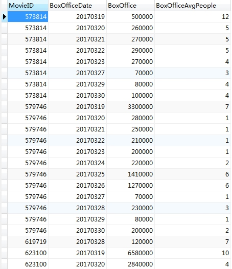

### 6.7 影片所属公司信息数据表
影片公司映射表信息：

| 属性名         | 属性说明    | 类型   | 主键   | 是否为空 |
| ----------- | ------- | ---- | ---- | ---- |
| MovieID     | 影片Id号   | Int  | 主键   | 不为空  |
| CompanyID   | 公司Id号   | Int  | 主键   | 不为空  |
| CompanyRank | 公司列表名次  | Int  |      |      |
| CompanyRole | 发行商和制作商 | Char |      |      |

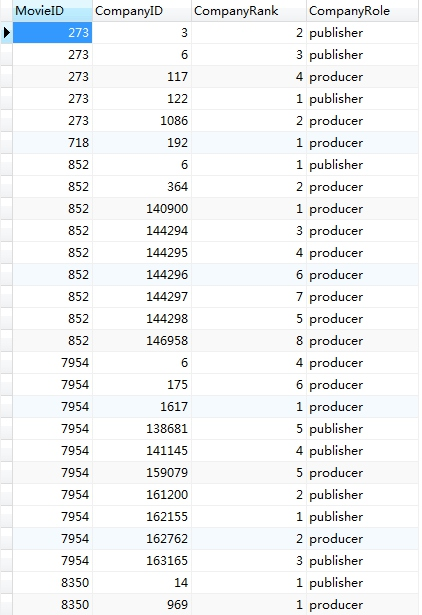

### 6.8 时光网影片数据表
时光网影片信息表：

| 属性名                | 属性说明     | 类型      | 主键   | 是否为空 |
| ------------------ | -------- | ------- | ---- | ---- |
| MovieIDMtime       | 时光网影片ID号 | Int     | 主键   | 不为空  |
| MovieENameMtime    | 影片英文名    | Varchar |      |      |
| MovieCNameMtime    | 影片中文名    | Varchar |      |      |
| MovieTypeMtime     | 影片类型     | Varchar |      |      |
| MovieLengthMtime   | 影片片场     | Int     |      |      |
| MovieDirectorMtime | 导演       | Char    |      |      |
| MovieYearMtime     | 年份       | Int     |      |      |

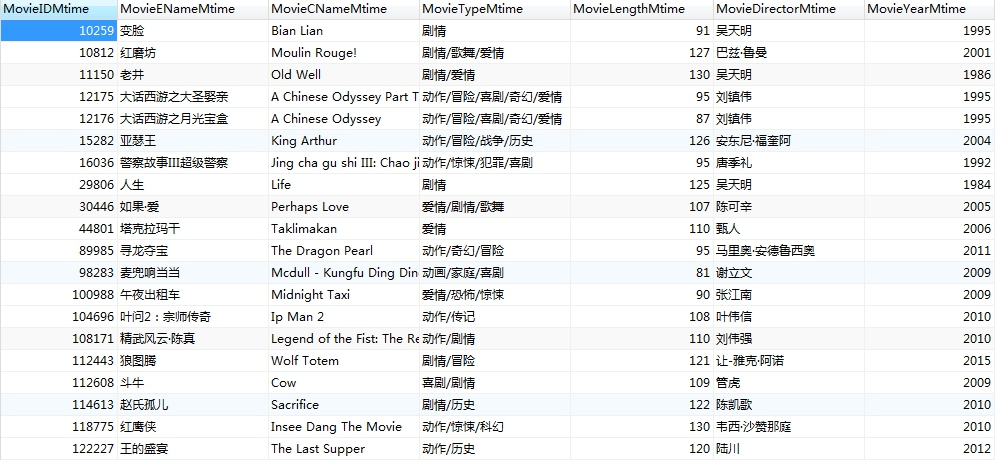

### 6.9 58921排片信息数据表
58921排片信息数据字段：

| 属性名             | 属性说明                     | 类型      | 主键   | 是否为空 |
| --------------- | ------------------------ | ------- | ---- | ---- |
| MovieID58921    | 58921网的电影ID号58921网的电影ID号 | Int     | 主键   | 不为空  |
| MovieCName58921 | 影片中文名                    | Varchar |      | 不为空  |
| ScheduleDate    | 排片信息日期                   | Int     | 主键   | 不为空  |
| CityName58921   | 排片信息城市名称                 | Varchar | 主键   | 不为空  |
| ScheduleScene   | 排片数                      | Varchar |      |      |

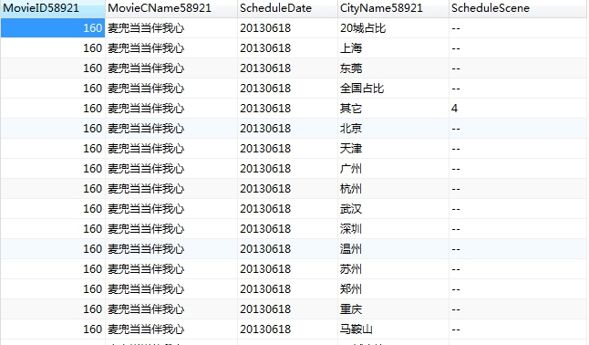

### 6.10 时光网影院排片数据表
时光网影片在影院的排片信息字段：

| 属性名                | 属性说明   | 类型   | 主键   | 是否为空 |
| ------------------ | ------ | ---- | ---- | ---- |
| MovieIDMtime       | 影片Id号  | Int  | 主键   | 不为空  |
| CinemaID           | 电影院Id号 | Int  | 主键   | 不为空  |
| CinemaDate         | 影片上映日期 | Int  | 主键   | 不为空  |
| SceneMtime         | 放映场次   | Int  |      |      |
| CinemaSumBoxOffice | 总票房数   | Int  |      |      |
| CinemaSumPeople    | 总观影人数  | Int  |      |      |

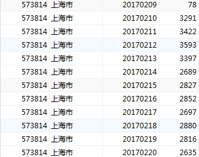

### 6.11 时光网影片放映信息
具体的放映信息表字段：

| 属性名              | 属性说明     | 类型   | 主键   | 是否为空 |
| ---------------- | -------- | ---- | ---- | ---- |
| CinemaID         | 电影院ID号   | Int  | 主键   | 不为空  |
| MovieIDMtime     | 时光网影片ID号 | Int  | 主键   | 不为空  |
| ShowTimeID       | 放映信息ID号  | Int  | 主键   | 不为空  |
| ShowTimeIDMtime  | 排片ID号    | Int  | 主键   | 不为空  |
| HallID           | 影厅ID号    | Int  | 主键   | 不为空  |
| HallSeatCount    | 影厅座位数量   | Int  |      |      |
| HallName         | 放映厅名称    | Char |      |      |
| ShowTimeLanguage | 语言       | Char |      |      |
| ShowTimeStarTime | 开始放映时间   | Char |      |      |
| ShowTimeEndTime  | 结束时间     | Char |      |      |
| PriceMtime       | 时光网票价    | Int  |      |      |
| StandardMtime    | 制式       | Char |      |      |

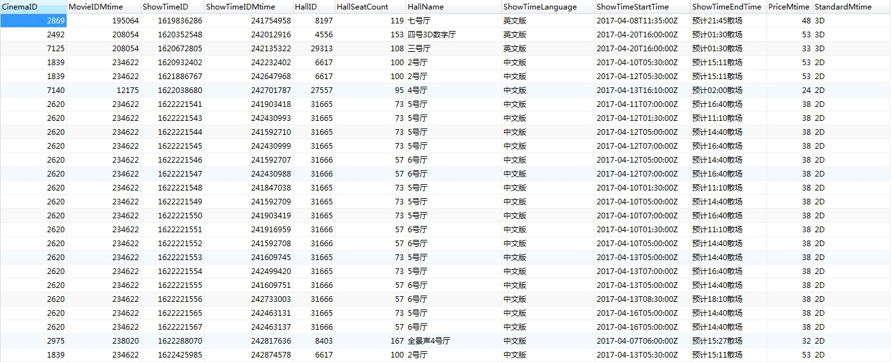

## 7. 遇到的问题以及解决方案
- 问题1
    - 如前所说，电影票房数据库(58921)网站上显示的数字是以图片的格式显示的，难以将其转化成数字格式存入数据库。
    - 解决方法：先将图片的url存入数据库。后来我们使用java写了一个图像识别程序，每天运行一次去识别已经爬取的图像，并转化成数字存入数据库。
- 问题2
    - 全国的影院数量和排片数量多的可怕，难以完整的爬取下来。
    - 解决方法：在浏览时光网的过程中偶然发现一个cinemadata文件，里面有所有的影院数据。同时发现了时光网的隐藏API，可以根据影院和日期查询该天该影院的拍片信息。
- 问题3
    - 由于我们有3个数据源，每个数据源的电影ID各不相同，电影名字记录也会存在偏差。无法确定到底是不是同一个影片。
    - 解决方法：建立一个对应表，将3个数据源的电影一一对应。首先用电影名称尝试对应，遇到名称不同的情况时收工对应。

## 8. 总结
我们使用Python做了数个爬虫，实现了抓取电影信息和与电影有关的其他信息如影人信息、公司信息等数据。 
同时我们还抓取了电影的实时票房、全国影院每日具体的拍片信息、全国城市的每日拍片数量等信息。 
在这过程中我们熟悉了Python语言，知晓了Python爬虫编写的过程，了解了Python爬虫所需要的一些库的使用方式。
如今我们的爬虫依然在服务器上每天运行着，数据量已经达到了百万级别。 
这些数据是进行大数据分析的珍贵资源。